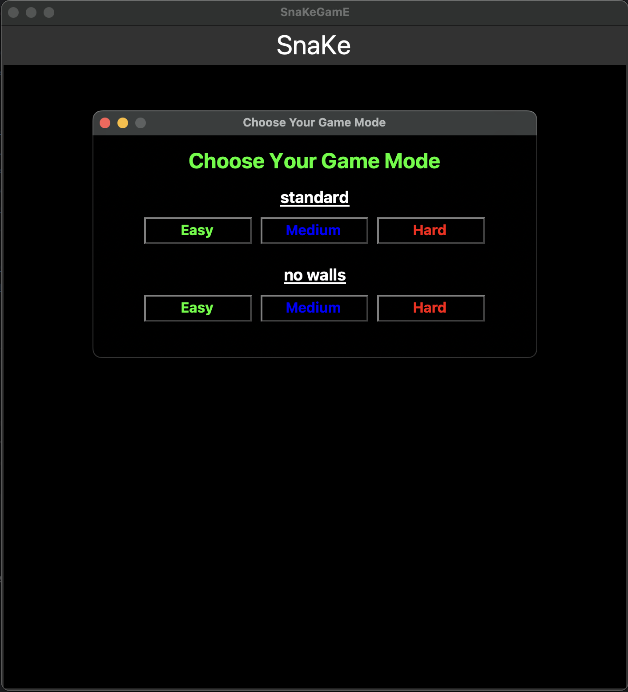

# Game of Snake in Python
A classic Snake Game implemented in Python using Tkinter for the GUI.

## Table of Contents
- [Introduction](#introduction)
- [Features](#features)
- [Screenshots](#screenshots)
- [Requirements](#requirements)
- [Installation](#installation)
- [Running the Game](#running-the-game)
- [Game Controls](#game-controls)
- [How to Play](#how-to-play)
- [High Score](#high-score-tracking)
- [Code Structure](#code-structure)
- [Classes](#classes)
- [Known Issues](#known-issues)
- [Future Improvements](#future-improvements)
- [Contact Information](#contact-information)

## Introduction
This Snake game is a modern take on the classic arcade game.
Navigate the snake to eat food, grow longer, and try to achieve the highest score possible.

## Features
- Simple and intuitive controls.
- Increasing difficulty as the snake grows.
- High score tracking saved between sessions.
- Different game modes.

## Screenshots
- ### **Demo**




- ### **Game Over Screenshot**


## Requirements
- **Python 3.6 or later**
- **Tkinter** (usually included with Python on Windows and macOS)

## Optional: Using a Virtual Environment

It's good practice to use a virtual environment to manage dependencies.

### Steps to Create a Virtual Environment

1. **Create a virtual environment:**
    ```bash
    python3 -m venv venv
    ```
2. **Activate the virtual environment:**
    - **Windows:**
        ```bash
        venv\Scripts\activate
        ```
    - **macOS and Linux:**
        ```bash
        source venv/bin/activate
        ```

3. **Install dependencies:**
    ```bash
    pip install -r requirements.txt
    ```

## Installation
### Windows and macOS
#### Download and install Python from the [official website](https://www.python.org/downloads/).

- #### **Make sure Tkinter is installed correctly:**
  - **Windows:** Reinstall Python and ensure the Tkinter option is selected.
  - **macOS:** Use Homebrew or reinstall Python from the official website.

### Linux
1. Install Python 3 and Tkinter
   - Debian/Ubuntu:
       ```bash
       sudo apt-get install python3 python3-tk
       ```
   - Fedora:
       ```bash
       sudo dnf install python3 python3-tkinter
       ```
   - Arch Linux:
       ```bash
       sudo pacman -S python tk
       ```
2. Verify installation:
    ```bash
    python3 --version
    python3 -m tkinter
    ```

3. Clone or download this repository to your local machine:
    ```bash
    # Using HTTPS
    git clone https://github.com/hub-mm/snake_game.git

    # Alternatively, using SSH
    git clone git@github.com:hub-mm/snake_game.git
    ```

## Running the Game
Navigate to the directory containing main.py file and run:
```bash
    cd snake
```

```bash
    python3 main.py
```
#### If *Python3* not recognised
```bash
    python main.py
```

## Game Controls
- **Movement**
    - Arrow Keys: *Up, Down, Left, Right*
    - WASD Keys: *W (up), A (Left), S (Down), D (right)*

## How to Play
- **Objective:** Eat as much food as possible to grow longer and increase your score.
- **Gameplay:**
  - Use the keyboard controls to navigate the snake.
  - Avoid colliding with the walls or the snake's own body.
  - Each time the snake eats food, it grows longer and moves slightly faster.
- **Scoring:**
  - Earn points for each piece of food consumed.
  - Try to beat the high score!

## High Score Tracking
- The game saves the highest scored achieved in a file named highscore.txt.
- The high score is displayed on the game over screen and next to the score.
- **Reset High Score:** To reset the high score, delete the *highscore.txt* file.

## Code Structure
- **main.py:** The main directory to start game.
- **constant_variables/:** Directory containing constant variables.
  - **constants.py:** File containing Constant variables.
- **elements/:** Directory containing classes needed for game.
  - **food.py:** File containing Food class.
  - **snake.py:** File containing Snake class.
- **game_play/:** Directory containing game play logic.
  - **game.py:** File containing Game class.
- **score/:** Directory containing score txt file.
  - **highscore.txt:** File containing Highscore (created automatically).


- **README.md:** File containing info for using and playing the game.
- **img/:** Directory containing game screenshots and assets.
- **requirements.txt:** File used when setting up a virtual environments.


## Classes
- **Snake:** Manages the snake’s position, movement, and rendering.
- **Food:** Manages food placement ensuring it doesn’t appear on the snake.
- **Game:** Handles game initialization, main loop, user input, collision detection, scoring, and game state management.

## Known Issues
- **Tkinter Not Installed Error:**
  - If you receive an error about Tkinter not being installed, 
    follow the installation steps in the [Requirements](#Requirements) section.
- **Game Window Not Focusing:**
  - On some systems, the game window may not come to the front automatically.
    Click on the window to activate it.

## Future Improvements
- Add sound effects and background music.
- Introduce obstacles and power-ups.

## Contact Information
- **GitHub:** [GitHub Profile: hub-mm](https://github.com/hub-mm) 